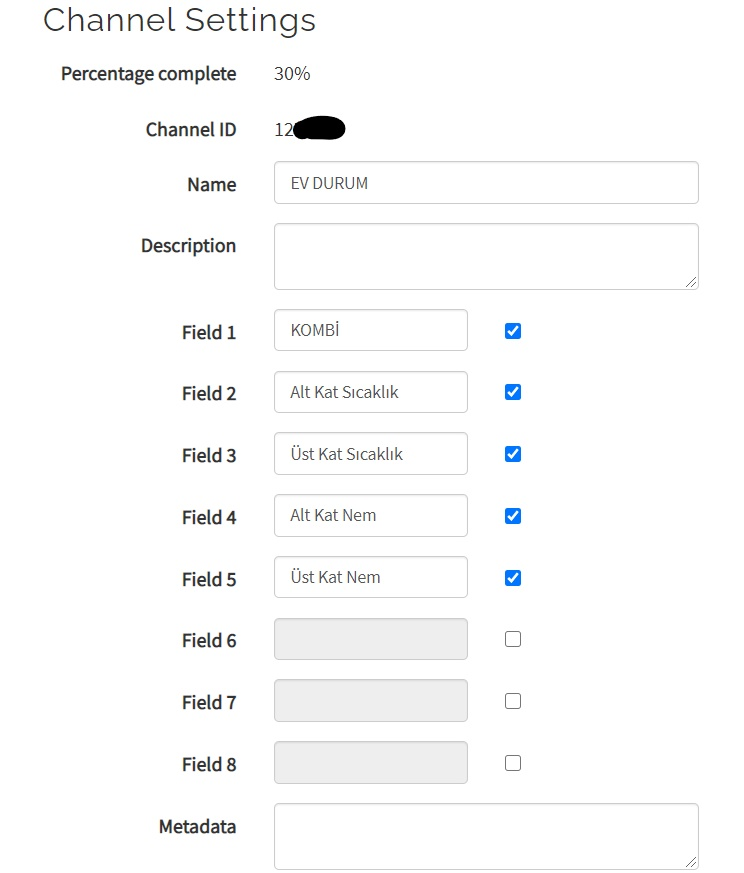

# Smart Plug with ThingSpeak

-ENG- 

Smart plug project allows you to control your plug from anywhere in the world. With this project, you can control the plugs you forgot to turn off or you want to turn on remotely.

-TR-
 
Akıllı priz projesi, prizlerinizi dünyanın her yerinden kontrol etmenizi sağlar. Bu proje ile açık unuttuğunuz ya da açmak istediğiniz prizleri kontrol etmeniz mümkün.

## Materials Needed
1x Arduino Uno

1x Breadboard

1x Esp8266-01

2x DHT 11     //optional according to the project to be made 

1x 5v Relay

3x 1k Ohm

1x 16v 100uf capacitor

x Jumpers

## Circuit Diagram

-ENG-

Attention! 

If you using esp8266-01 for the first time Shouldn't forget to do the esp update!

If you don't know the how does esp update is done please visit: https://maker.robotistan.com/esp8266-ile-iot-dersleri-1-esp8266-modulunu-guncelleme/

To download the program required for the Esp update, please visit: https://maker.robotistan.com/download/ESP8266-Uptade.zip

-TR-

Uyarı!

ilk kez esp8266-01 kullanacaklar Esp güncellemesini yapmayı unutmamalıdır!

Esp güncellemesinin yapıldığını bilmiyorsanız lütfen ziyaret edin: https://maker.robotistan.com/esp8266-ile-iot-dersleri-1-esp8266-modulunu-guncelleme/

Esp güncellemesi icin gerekli olan programı indirmek için lütfen ziyaret edin: https://maker.robotistan.com/download/ESP8266-Uptade.zip

-ENG- 

Note: This project is designed to obtain temperature information from 2 different rooms. Those who want to read temperature information from a single room can use 1x dht 11 sensor.

**People who will only use this project as a smart plug do not need to use DHT sensors.**

-TR- 

Not: Bu proje 2 farklı odadan sıcaklık bilgisi alınacak şekilde tasarlanmıştır. Tek bir odadan sıcaklık bilgisi almak isteyenler 1 adet dht 11 sensörü kullanabilirler.

**Bu projeyi sadece akıllı priz olarak kullanacak kişilerin DHT sensörlerini kullanmasına gerek yoktur.**

## Details About Usage

-ENG- 

After creating a ThingSpeak account and a github account, you can make arrangements as shown in the figure.

-TR-

Bir ThingSpeak hesabı ve bir github hesabı oluşturduktan sonra, şekilde gösterildiği gibi düzenlemeleri yapabilirsiniz.

**For ThingSpeak / ThingSpeak İçin:**

**1-Channel Settings / Kanal Ayarları:**

**2-App Settings / Uygulama Ayarları:**

**3-Channel / Kanal:**

**For github / Github icin:**

-ENG-

-When a connection problem is encountered, a retry will be made until it is connected. The connection problem was tried to be minimized for times when not at home.

-You can check it by changing 1-0 on github.

-You can check whether the values have changed or not on ThingSpeak, and have detailed information about the situations.

-If there is a power failure, it will switch to low mode, not the mode it is inactive.

-In case of power failure, 3 information will be given to thingspeak except 1-0 information. When you see the number 3, you can understand that the electricity is back and forth.

-TR- 

-Bir bağlantı sorunuyla karşılaşıldığında, bağlanana kadar yeniden deneme yapılacaktır. Evde olmadığınız zamanlarda bağlantı sorunu en aza indirilmeye çalışıldı.

-Github üzerindeki 1-0 değerini değiştirerek kontrol edebilirsiniz.

-Değerlerin değişip değişmediğini ThingSpeak üzerinden kontrol edebilir, durumlar hakkında detaylı bilgiye sahip olabilirsiniz.

-Elektrik kesintisi olduğunda en son duruma değil kapalı moda geçecektir.

-Elektrik kesintisi durumunda, 1-0 bilgisi dışında 3 bilgisi verecektir 3 sayısını gördüğünüzde elektriğin ileri geri olduğunu anlayabilirsiniz.
